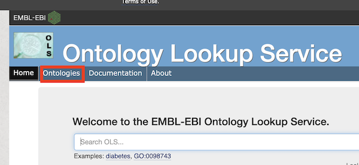

# EBI's Ontology Lookup Service (OLS) for the NMDC Ontology (NMDCO)

## Running the EMBL-EBI Ontology Lookup Service with Docker  

In order to view the NMDC Ontology in a local [EBI's Ontology Lookup Service](https://www.ebi.ac.uk/ols/) you must have [Docker](https://www.docker.com/) installed on your machine.  

To run the EMBL-EBI OLS service:
1. Build the Docker image by either using the shell script `docker-build.sh`, or executing the command `cp ../nmdco.owl .; docker build -t nmdco .`.
2. Start the Docker container by either using the shell script `docker-run.sh`, or executing the command `docker run -dtp 8080:8080 --rm --name nmdco nmdco`.
3. Access the OLS through your browser on http://localhost:8080. It may take a **minute or two** for the OLS to start up.
4. After you are finished browsing, you stop the container by either using the shell script `docker-stop.sh`, or executing the command `docker container stop nmdco`.

## Finding Terms

When you open the OLS in your web browser, you can find terms either by typing a term into the search box or browsing the ontology tree.    
To search for terms, simply start typing the term you are looking for in the search box.   

As you type a term (such as 'soil') into the search box, this will bring a list of terms to choose from.

After you select the term you want, you will be taken to a screen with the term's definition and a view of the term in the taxonomic tree (see below). The  means the child term is "part of" the parent term. 

To go directly to the ontology tree, first click on the "Ontologies" link (outlined in red).

Next click on the "NMDC Ontology" link (outlined in red.)

On this screen, you can either search for a term (like above), or start browsing the tree by clicking the "+" and "-" icons.

## Configuration 

To change the behavior of the ols-docker, edit [ols-config.yaml](ols-config.yaml) with the metadata for each ontology you want to load into OLS. Any ontology in OBO or OWL format will work. 

Note, to load an ontology from a local file on disk, you add the ontology to the `${OLS_HOME}` in the [Docker file](Dockerfile), directory and set `ontology_purl: file:///opt/ols/<filename>.owl` in the [ols-config.yaml file ](ols-config.yaml). Alternately you can use a URL to load an ontology from the web e.g. `ontology_purl: http://purl.obolibrary.org/obo/envo.owl` 

## Rebuilding the image and relaunching the container

After changing the configuration, you will need to rebuild the image and relaunch the container.  

First, make sure the container has stopped running by either using the shell script `docker-stop.sh`, or executing the command `docker container stop nmdco`.

Second, rebuild the image by either using the shell script `docker-build.sh`, or executing the command `cp ../nmdco.owl .; docker build -t nmdco .`.  

Often, you may find it necessary to delete the image and container before rebuilding. This can be done by either using the shell script `docker-remove.sh`, or exeuting the commands` docker container rm nmdco` and `docker image rm nmdco`

Finally, relaunch the by container by either using the shell script `docker-run.sh`, or executing the command `docker run -dtp 8080:8080 --rm --name nmdco nmdco`.
